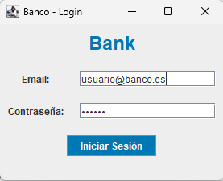
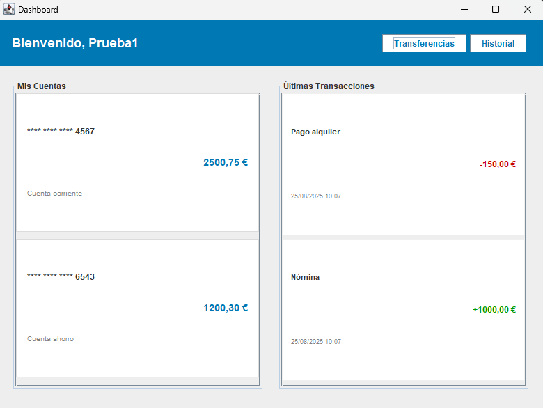
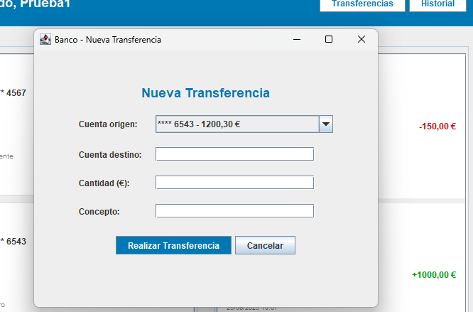

# Banking Application

Una aplicación bancaria de escritorio desarrollada en Java con Swing, implementando el patrón MVP (Model-View-Presenter) y arquitectura modular.

## Tabla de Contenidos

- [Características](#características)
- [Arquitectura](#arquitectura)
- [Instalación](#instalación)
- [Uso](#uso)
- [Estructura del Proyecto](#estructura-del-proyecto)
- [Configuración](#configuración)
- [Seguridad](#seguridad)
- [Logging](#logging)
- [Autoría](#autoría)

## Características

### Funcionalidades Principales
- **Autenticación segura** con validación de credenciales y bloqueo por intentos fallidos
- **Dashboard principal** con información de cuentas y transacciones recientes
- **Sistema de transferencias** entre cuentas con validaciones
- **Gestión de múltiples cuentas** (Corriente, Ahorro, Nómina)
- **Historial de transacciones** con categorización por tipo

### Características Técnicas
- **Arquitectura MVP** para separación de responsabilidades
- **Operaciones asíncronas** para mejor experiencia de usuario
- **Pool de hilos** gestionado centralmente
- **Sistema de logging** configurable con múltiples niveles
- **Manejo robusto de excepciones** con tipos específicos
- **Configuración externa** mediante archivos properties
- **Validaciones de entrada** y seguridad
- **Thread Safety**: Usar `SwingUtilities.invokeLater()` para actualizaciones de UI


## Arquitectura

La aplicación sigue el patrón **MVP (Model-View-Presenter)** con las siguientes capas:

```
┌─────────────────┐
│     Views       │ ← Interfaz de usuario (Swing)
│   (UI Layer)    │
└─────────────────┘
         │
┌─────────────────┐
│   Presenters    │ ← Lógica de presentación
│ (Control Layer) │
└─────────────────┘
         │
┌─────────────────┐
│    Services     │ ← Lógica de negocio
│ (Business Layer)│
└─────────────────┘
         │
┌─────────────────┐
│     Models      │ ← Entidades de datos
│  (Data Layer)   │
└─────────────────┘
```

### Componentes Principales

- **Views**: Interfaces gráficas implementadas con Swing
- **Presenters**: Coordinan la comunicación entre Views y Services
- **Services**: Contienen la lógica de negocio (AuthService, BankingService)
- **Models**: Entidades de datos (User, Account, Transaction)
- **Exceptions**: Manejo tipado de errores
- **Config**: Gestión de configuración y logging


## Instalación

### Clonar e Instalar

```bash
# Clonar el repositorio
git clone https://github.com/tu-usuario/app-bank.git
cd app-bank

# Compilar el proyecto
javac -d bin -cp src src/main/Main.java src/**/*.java

# Ejecutar la aplicación
java -cp bin main.Main
```

### Usando Maven (si aplica)

```bash
# Compilar
mvn clean compile

# Ejecutar
mvn exec:java -Dexec.mainClass="main.Main"

# Generar JAR
mvn clean package
java -jar target/app-bank-1.0.jar
```

## Uso

### Credenciales de Prueba

```
Email: usuario@banco.es
Contraseña: 123456
```

### Flujo de Uso

1. **Iniciar Sesión**
   - Introducir credenciales en la pantalla de login
   - El sistema valida y autentica al usuario

2. **Dashboard Principal**
   - Ver resumen de cuentas disponibles
   - Consultar últimas transacciones
   - Acceder a funcionalidades principales

3. **Realizar Transferencias**
   - Seleccionar cuenta origen
   - Introducir cuenta destino, cantidad y concepto
   - Confirmar la transferencia

### Capturas de Pantalla

### Pantalla de Login



### Dashboard



### Transferencias



## Estructura del Proyecto

```
app-bank/
├── src/
│   ├── main/
│   │   └── Main.java                 # Punto de entrada
│   ├── views/                        # Interfaces gráficas
│   │   ├── LoginView.java
│   │   ├── DashboardView.java
│   │   └── TransferenceView.java
│   ├── presenters/                   # Lógica de presentación
│   │   ├── LoginPresenter.java
│   │   ├── DashboardPresenter.java
│   │   └── TransferencePresenter.java
│   ├── services/                     # Servicios de negocio
│   │   ├── AuthService.java
│   │   ├── BankingService.java
│   │   └── ThreadPoolManager.java
│   ├── models/                       # Entidades de datos
│   │   ├── User.java
│   │   ├── Account.java
│   │   └── Transaction.java
│   ├── interfaces/                   # Contratos MVP
│   │   ├── LoginContract.java
│   │   ├── DashboardContract.java
│   │   └── TransferenceContract.java
│   ├── exceptions/                   # Excepciones tipadas
│   │   ├── BankingException.java
│   │   ├── AuthenticationException.java
│   │   ├── ValidationException.java
│   │   └── ...
│   └── config/                       # Configuración
│       ├── ConfigurationManager.java
│       └── LoggingConfig.java
├── logs/                            # Archivos de log
├── resources/
│   └── application.properties       # Configuración
└── README.md
```

## Configuración

### Archivo de Configuración (application.properties)

```properties
# Configuración de la aplicación
app.name=Banking App
app.version=1.0.0
app.environment=development

# Configuración de red
network.connection.timeout=30000
network.read.timeout=15000
network.max.retries=3

# Configuración de seguridad
security.session.timeout=1800000
security.max.login.attempts=3
security.lockout.duration=300000

# Configuración de UI
ui.theme=system
ui.window.width=800
ui.window.height=600

# Configuración de logging
logging.level=INFO
logging.file.enabled=true
logging.console.enabled=true
```

### Variables de Sistema

Puedes sobrescribir configuraciones usando propiedades del sistema:

```bash
java -Dapp.environment=production \
     -Dlogging.level=WARNING \
     -Dsecurity.session.timeout=3600000 \
     -cp bin main.Main
```


## Seguridad

### Características de Seguridad Implementadas

- **Hash de contraseñas** usando SHA-256 con salt
- **Bloqueo por intentos fallidos** configurable
- **Validación de entrada** para prevenir ataques
- **Timeout de sesión** automático
- **Logging de eventos de seguridad**

## Logging

### Configuración de Logs

La aplicación genera logs en múltiples niveles:

```
logs/
├── app-bank-0.log          # Logs generales
├── app-bank-errors-0.log   # Solo errores y warnings
└── ...
```

### Niveles de Log

- **SEVERE**: Errores críticos que afectan la funcionalidad
- **WARNING**: Situaciones problemáticas que no impiden el funcionamiento
- **INFO**: Información general sobre el flujo de la aplicación
- **FINE/FINER/FINEST**: Información detallada para debugging

### Ejemplo de Uso de Logging

```java
private static final Logger LOGGER = Logger.getLogger(MiClase.class.getName());

public void miMetodo() {
    LOGGER.info("Iniciando operación");
    
    try {
        // Lógica del método
        LOGGER.fine("Operación completada exitosamente");
    } catch (Exception e) {
        LOGGER.log(Level.SEVERE, "Error en operación", e);
        throw e;
    }
}
```

## Autoría
Aplicación desarrollada por Antonio Ortega.

**Nota**: Esta es una aplicación de demostración con fines educativos, sin persistencia.
